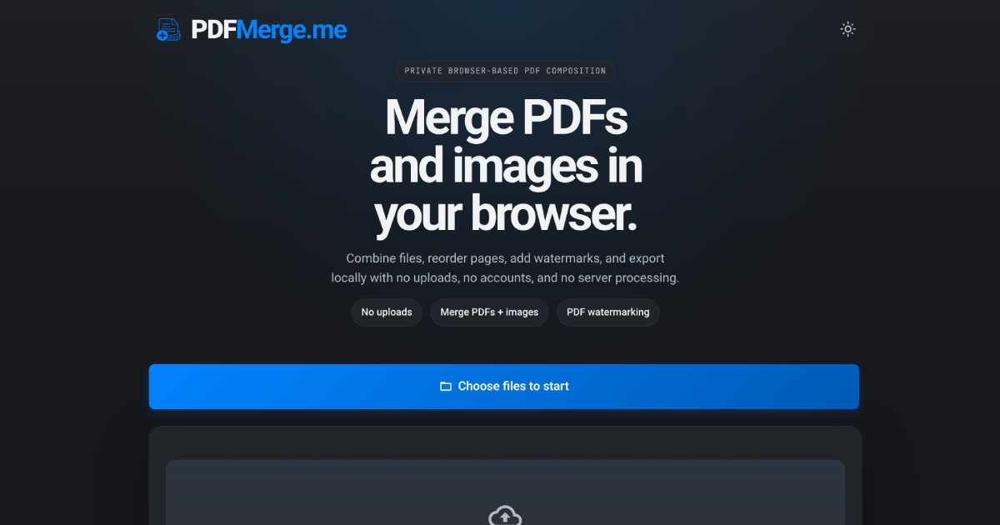

# PDFMerge

PDFMerge is a free, privacy-first web app for merging PDFs and images into a single document. All processing runs entirely in your browser: nothing is uploaded to any server.

Live at [pdfmerge.me](https://pdfmerge.me)

## Key Features

### File Handling

- **PDF and Image Merging**: Combine PDFs with JPG, PNG, WEBP, and GIF images
- **Drag and Drop**: Add files by dragging onto the page, or reorder cards by dragging
- **PDF Page Selection**: Specify page ranges (`1-5`), individual pages (`1,3,7`), or a mix (`1-3,5,8`) per PDF
- **Blank Page Insertion**: Add blank separator pages to the output
- **Individual File Removal**: Delete specific files with per-card remove buttons

### Image Layout Options

Each image can be placed on its page in one of three modes:

- **Default Margins**: Scaled with printer-safe margins
- **Cover**: Cropped to fill the full page
- **Fit**: Scaled to fit with letterbox background

Use the Toggle Image Rotation button to rotate the image content 90, 180, or 270 degrees independently of the layout mode.

### Output Options

- **Paper Sizes**: A0, A1, A2, A3, A4, Letter, Legal, Tabloid
- **Page Orientation**: Toggle any image page between portrait and landscape
- **Page Numbers**: Optionally add sequential image numbers
- **Image Details**: Optionally embed EXIF data (filename, date, GPS coordinates)
- **Image Hash**: Optionally embed SHA-256 hash per image for verification
- **Custom Filename**: User-defined output filename

### Watermarking

- Custom text watermark with full control over colour, opacity, rotation, and scale
- Single centred watermark or tiled pattern across every page

### Privacy and Performance

- No server uploads: all PDF and image processing happens locally in your browser; your files are never uploaded
- Self-hosted assets: all fonts, scripts, and assets are served from the same origin (no third-party CDNs)
- The only external request is to Cloudflare Web Analytics (`cloudflareinsights.com`), a cookieless, privacy-preserving page-view counter that collects no personal data and no file content
- Cancel mid-merge at any time
- Progress bar with 60-second timeout protection
- Dark and light mode, persisted across sessions
- All settings persisted to localStorage and reset to defaults after a successful merge

## Browser Compatibility

- **Optimal**: Google Chrome (latest)
- **Good**: Firefox, Safari, Edge (latest versions)

## Known Limitations

PDFMerge runs client-side, so performance is limited by your device and browser. Image files are capped at 50 MB due to browser memory constraints when resizing via the Canvas API. For very large images, reduce size or resolution before uploading. Chrome generally handles larger batches better than Firefox.

## Technical Notes

- **Architecture**: Static single-page app with vanilla JavaScript ES modules: no build step, no framework, no server
- **PDF Engine**: pdf-lib for PDF creation and manipulation; PDF.js for thumbnail rendering
- **Font Handling**: UI fonts (Roboto, JetBrains Mono, Material Icons Outlined) are self-hosted in `fonts/web/`. Roboto is also embedded in output PDFs via fontkit using files in `fonts/`
- **EXIF Extraction**: exif-js reads metadata from JPEG files before embedding
- **Security**: Content Security Policy restricts `default-src` to `'self'`; the only permitted external origin is Cloudflare Web Analytics (`script-src`/`connect-src`). No third-party scripts, fonts, or trackers are loaded

## Credits and Third-Party Licensing

- **[pdf-lib](https://pdf-lib.js.org/)** v1.17.1 by Andrew Dillon | [MIT License](https://opensource.org/licenses/MIT)
- **[PDF.js](https://mozilla.github.io/pdf.js/)** v4.10.38 by Mozilla | [Apache License 2.0](https://www.apache.org/licenses/LICENSE-2.0)
- **[exif-js](https://github.com/exif-js/exif-js)** v2.3.0 | [MIT License](https://opensource.org/licenses/MIT)
- **[fontkit](https://github.com/foliojs/fontkit)** v1.1.1 | [MIT License](https://opensource.org/licenses/MIT)
- **Roboto Font** by Christian Robertson | [Apache License 2.0](https://www.apache.org/licenses/LICENSE-2.0)
- **JetBrains Mono** by JetBrains | [SIL Open Font License 1.1](https://openfontlicense.org/)
- **Material Icons** by Google | [Apache License 2.0](https://www.apache.org/licenses/LICENSE-2.0)
